# Automated Endpoint Containment with SOAR and EDR

> **Tools:** LimaCharlie (EDR) · Tines (SOAR) · Slack · Windows Server (Cloud VM)
> 

> **Skills demonstrated:** Detection engineering · SOAR playbook design · EDR API integration · Analyst-in-the-loop automation · Incident response workflow
> 

This project builds an automated endpoint containment pipeline that detects credential-dumping activity on a Windows host, alerts analysts via Slack and email, and isolates the machine from the network upon analyst approval — all without manual intervention beyond the containment decision itself.

# Prerequisites

To replicate this project, the following accounts and resources are required:

- **LimaCharlie** — Free tier account at [limacharlie.io](http://limacharlie.io). Used to deploy the EDR sensor and author Detection & Response rules.
- **Tines** — Free Community account at [tines.com](http://tines.com). Used to build and host the automation workflow.
- **Slack** — A Slack workspace with a dedicated alerts channel. Used for analyst notification delivery.
- **Windows Endpoint** — A cloud VM (e.g., Vultr or DigitalOcean) running Windows Server. Used as the monitored host. A minimum of 1 vCPU / 2GB RAM is sufficient for this project.
- **Email account** — Any email address accessible for testing alert delivery.

No prior experience with LimaCharlie or Tines is required, though familiarity with basic detection concepts and REST APIs is helpful. Both platforms offer free tiers that are sufficient to complete the full workflow described here.

---

# Project Overview

Modern security operations environments generate a large volume of alerts from endpoint detection systems. While these alerts provide valuable visibility into endpoint activity, they often require manual triage and response from analysts. As alert volume increases, response speed and consistency can suffer if containment actions rely entirely on manual investigation.

This project explores how detection telemetry from an endpoint detection platform can be integrated with a Security Orchestration, Automation, and Response (SOAR) system to streamline parts of the response workflow. The goal was not to fully automate incident response, but to demonstrate how automation can support analysts by handling alert delivery, contextual enrichment, and controlled response actions.

This design demonstrates a hybrid response model in which automation reduces manual effort while still preserving human oversight for high-impact actions such as isolating systems.

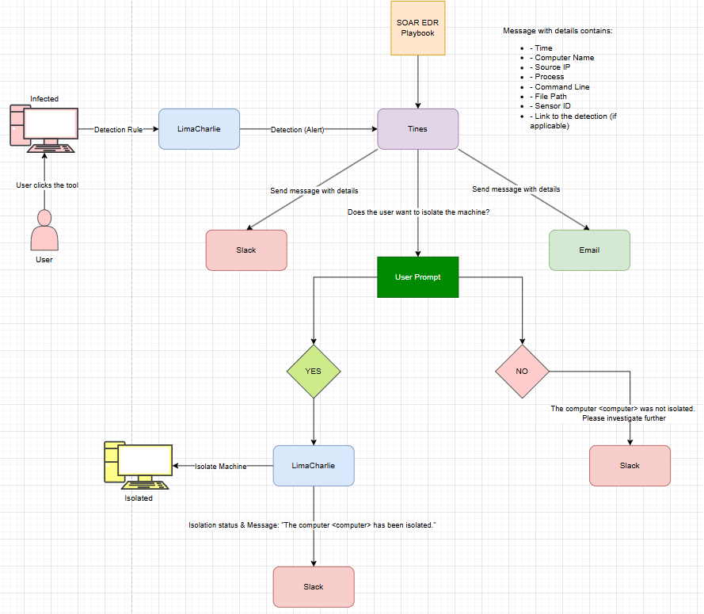

**Automated SOAR workflow that detects an infected endpoint via LimaCharlie, sends alerts through Slack/Email, prompts the user for confirmation, and isolates the machine if approved.**

---

# Environment and Architecture

The project environment consists of several systems that collectively simulate a simplified security operations workflow. Each component performs a specific role within the detection and response pipeline, allowing telemetry generated by an endpoint to move through detection, automation, and response stages before containment actions are applied.

| Component | Role |
| --- | --- |
| LimaCharlie | Endpoint Detection and Response (EDR) platform used to monitor host activity |
| Tines | SOAR platform responsible for executing the automation workflow |
| Slack | Analyst notification platform used to deliver alerts |
| Windows Endpoint | Monitored system used to generate telemetry and trigger detections |

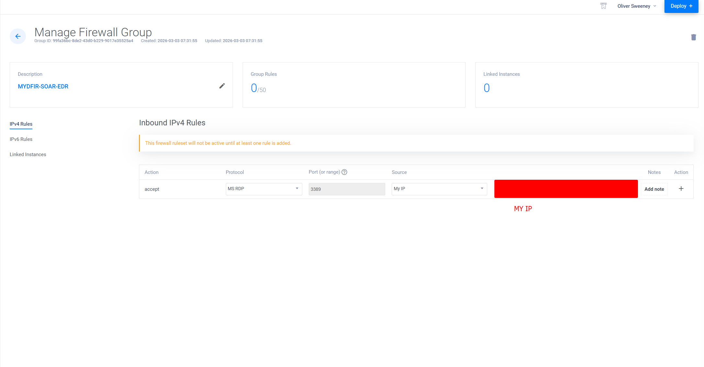

Firewall being setup so I can safely RDP into the Windows endpoint.

The Windows endpoint acts as the primary source of telemetry within the environment. Activity occurring on the host is collected by the LimaCharlie sensor and forwarded to the platform where it can be analyzed by detection rules. This telemetry includes process execution events, command-line activity, user context, and host metadata, all of which can be used to identify suspicious behavior.

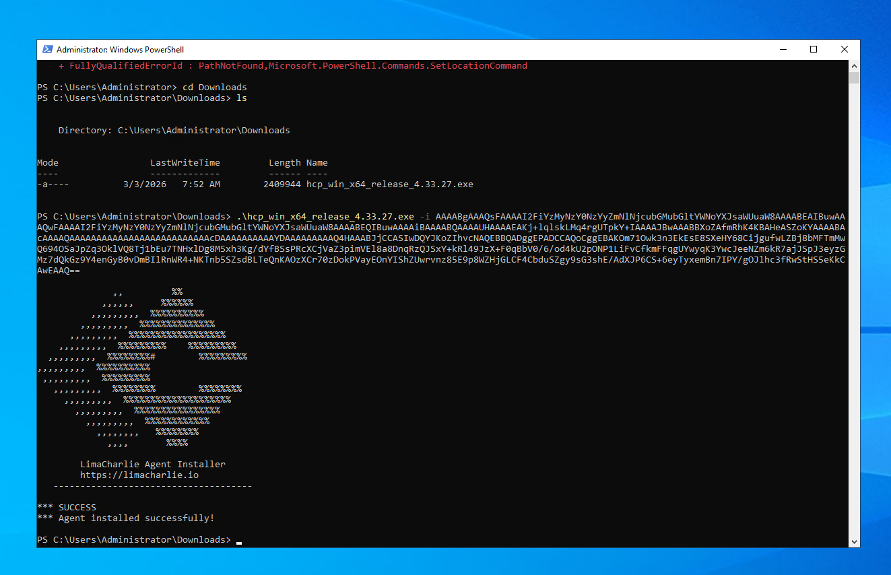

LimaCharlie sensor being installed on the Windows Endpoint

Once the endpoint sensor is installed and begins reporting telemetry, the host becomes visible within the LimaCharlie console. At this stage the system is actively monitored, allowing detection rules to be applied to incoming telemetry. Establishing reliable endpoint visibility is a prerequisite for the remainder of the project, as the automation workflow ultimately depends on detection events generated from this telemetry.

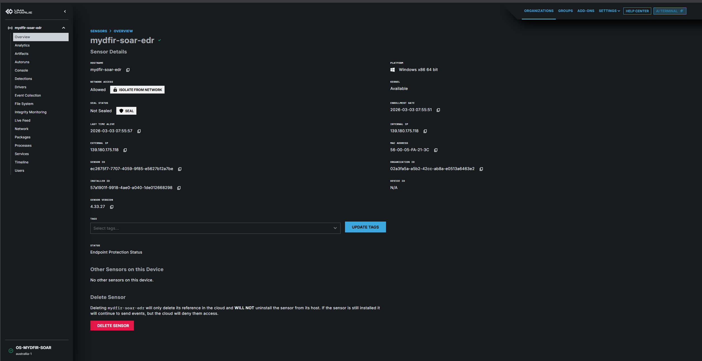

MyDFIR-SOAR-EDR (the windows endpoint) is successfully connected to LimaCharlie and is now a visible sensor.

Rather than relying solely on the EDR interface to manage alerts, this project integrates the detection pipeline with a SOAR platform. In many operational environments, security teams use automation platforms to centralize alert handling, enrich detection data, and coordinate response actions across multiple systems. By forwarding detections to the SOAR platform, the project demonstrates how automation can extend the capabilities of an EDR system and streamline analyst workflows.

Within this architecture, LimaCharlie generates detection events and forwards them to the automation platform through a webhook integration. The automation workflow then processes the event, extracts relevant information, and determines how the alert should be handled, including whether containment actions should be executed.

---

# Detection Engineering

With the endpoint successfully onboarded and reporting telemetry, the next step was designing a detection capable of identifying suspicious activity on the host. The objective was to detect the execution of a credential-extraction utility commonly used during post-exploitation phases of an intrusion.

Tools capable of extracting stored credentials often appear during later stages of an attack, when an adversary has already gained initial access and is attempting to escalate privileges or move laterally through the environment. Monitoring for the execution of these tools can therefore provide a meaningful signal that malicious activity is occurring on the system.

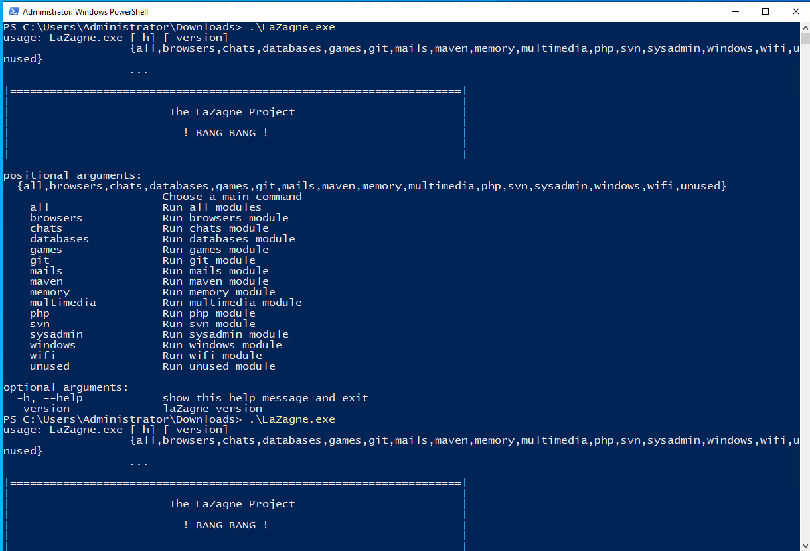

LaZange is post-exploitation tool designed to grab credentials that are stored locally.

To validate the detection pipeline, the credential-extraction tool **LaZagne** was executed on the monitored endpoint. Running the tool generates process execution telemetry that can be analyzed by the LimaCharlie detection engine.

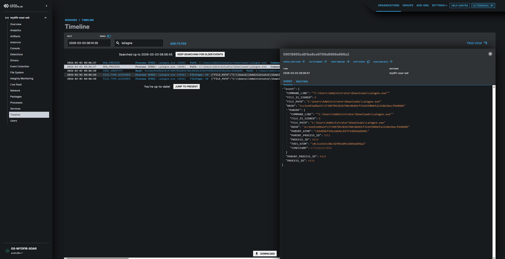

Looking into the timeline on the sensor we can see after it is run in PowerShell we can see a number of events including process creation.

When the tool was executed, the detection rule configured within the platform triggered as expected, generating a detection event associated with the suspicious process.

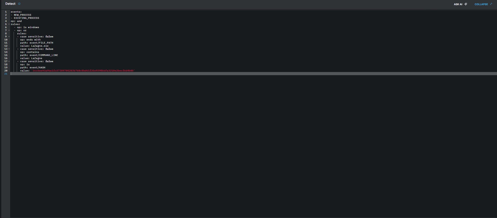

The detect portion of the D&R rule we developed in LimaCharlie.

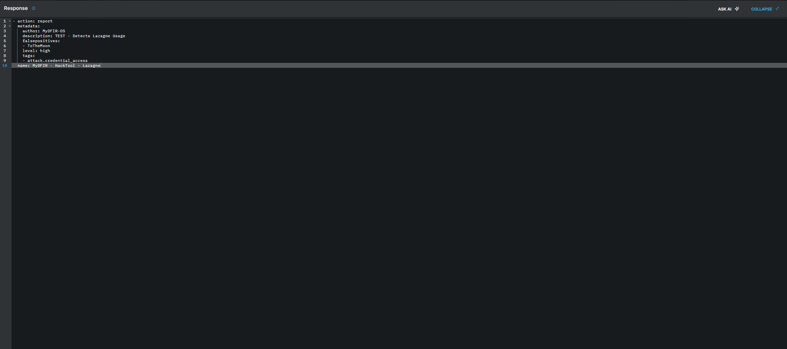

The response portion of the D&R rule we developed in LimaCharlie.

The resulting detection contains structured metadata describing the activity observed on the endpoint. This includes the process command line, executable file path, user context, hostname, and the sensor identifier associated with the host.

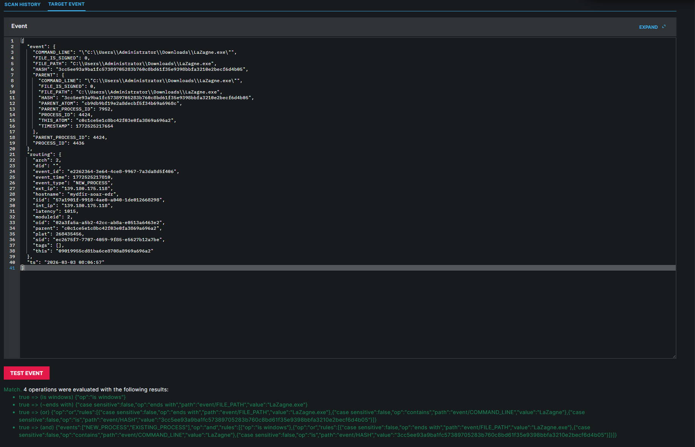

The D&R rule being tested on the event of LaZagne process creation event we saw earlier.

These fields become particularly important later in the project because they provide the contextual information required by the automation workflow. By forwarding this structured detection event to the SOAR platform, the automation system can extract key values and use them to generate alerts, prompt analyst decisions, and execute containment actions when required.

The detection rule is written in LimaCharlie's D&R (Detect & Respond) rule format. The detect block targets `NEW_PROCESS` events where the process name matches `lazagne.exe`, and the respond block generates an alert and forwards it to the configured output (the Tines webhook). The rule structure is shown below:

This rule generates a structured detection payload whenever the process is observed on any monitored endpoint, which becomes the input event for the downstream SOAR workflow.

---

# Alert Ingestion Pipeline

After validating that the detection rule successfully identifies suspicious activity, the next step was establishing a reliable method for forwarding detection events to the automation platform. Without this ingestion pipeline, the SOAR workflow would not receive the events required to trigger automated responses.

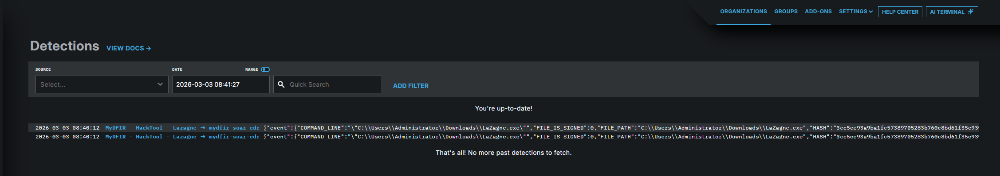

The D&R rule now firing a detection when the tool is used again on the Windows Endpoint.

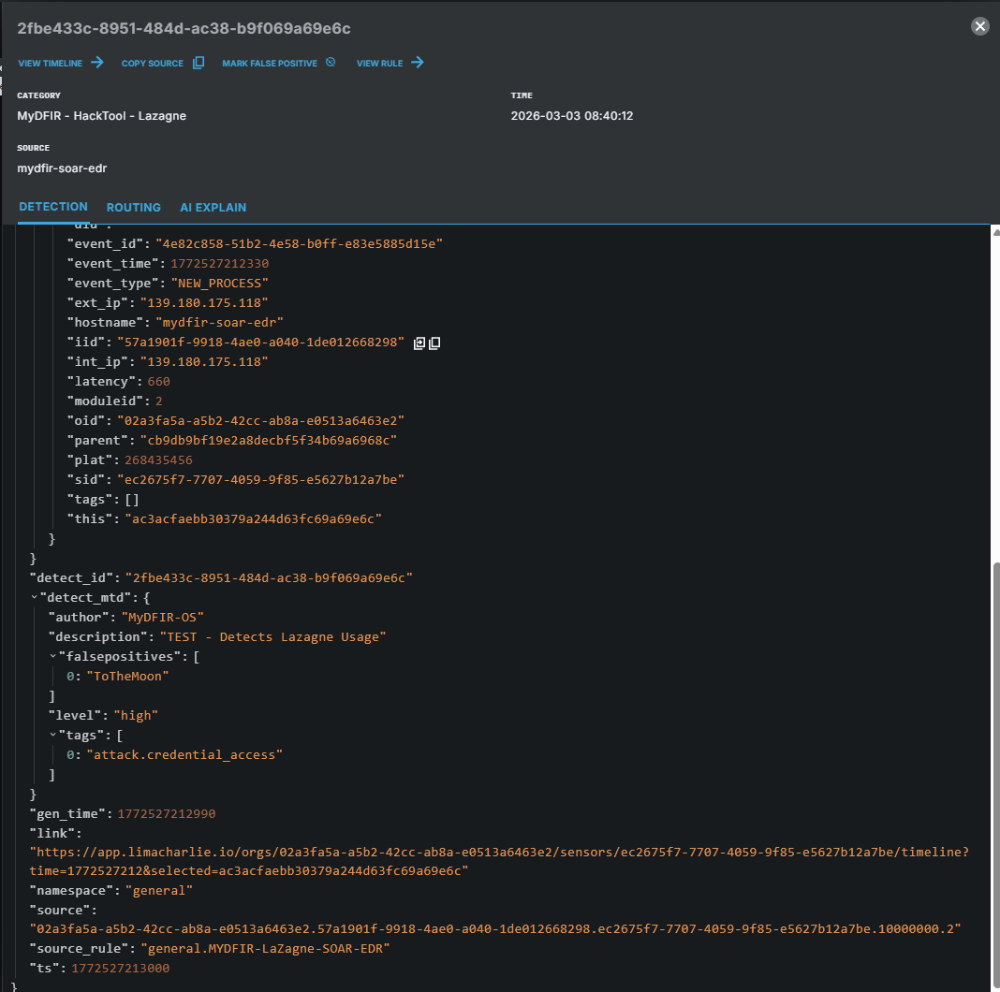

The telemetry that was generated from the D&R rule.

To accomplish this, a webhook endpoint was created within the Tines platform. This webhook acts as the entry point for incoming detection events and allows the automation workflow to receive telemetry generated by the EDR platform.

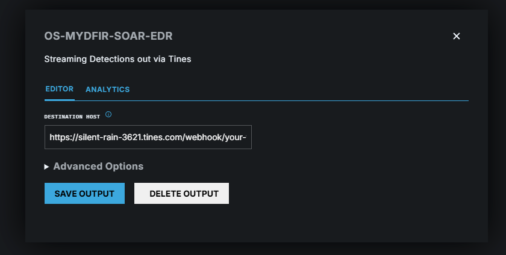

The webhook on Tines being setup.

Once the webhook endpoint was created, the LimaCharlie platform was configured to stream detection events to this endpoint using its output configuration feature. This allows the platform to continuously send detection data to external systems whenever a rule is triggered.

To confirm that the pipeline was functioning correctly, the credential-extraction tool was executed again on the monitored endpoint. This generated a new detection event which was automatically forwarded to the webhook endpoint in Tines.

Inspecting the received event within Tines confirmed that the complete detection payload had been successfully delivered. The payload included multiple fields describing the event, such as the command line used to execute the process, the user associated with the activity, the hostname of the affected system, and the sensor identifier used by the EDR platform.

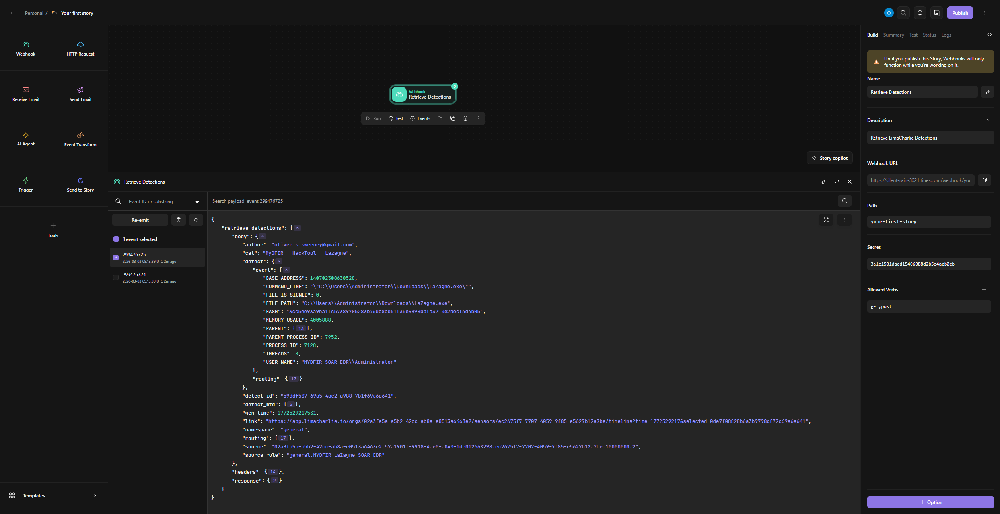

The telemetry being generated being pushed to the webhook on Tines.

Validating this pipeline is an important step before building any automation logic. If detection events cannot be reliably delivered to the automation platform, downstream actions such as alerting, analyst decision prompts, and containment operations would not function correctly.

---

# Automation Playbook Design

With the detection ingestion pipeline validated, the next stage of the project involved designing the automation playbook responsible for handling detection events. The playbook defines how the automation platform should respond once a detection is received.

When a detection event enters the workflow, the automation system first parses the payload and extracts the fields that provide the most useful investigative context. These include the detection title, timestamp, hostname, username, command line, file path, and a direct link to the detection event within the EDR platform.

These values are then used to construct alert notifications delivered through Slack and email. Providing structured information within the alert message allows analysts to quickly understand what occurred on the system without manually navigating through the raw detection telemetry.

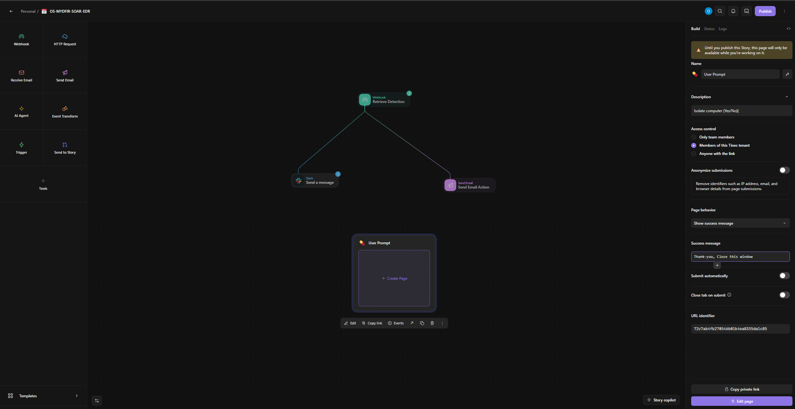

We have configured Tines to send an alert via Slack and Email when the D&R rule is triggered on Lima Charlie

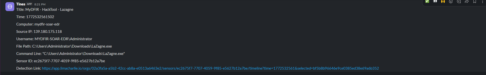

The telemetry is extracted from the rule and sent in readable format to the alerts channel on Slack.

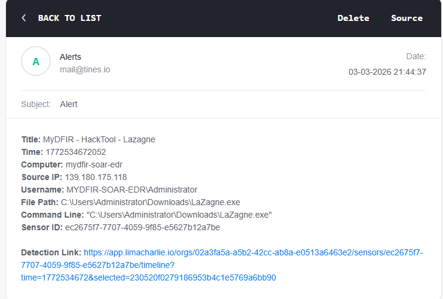

The alert being sent to analysts email. The hyperlink takes the analyst straight to the event in LimaCharlie where further investigation can begin to occur.

---

# Analyst Decision Workflow

While automation can significantly reduce response time, fully automated containment actions can also introduce operational risk. Isolating a host from the network may interrupt legitimate user activity or disrupt business processes if the alert turns out to be a false positive. Because of this, many real-world security operations teams implement a decision point before executing containment actions.

To address this, the automation workflow introduces an analyst prompt after the initial alert is generated. This prompt allows an analyst to review the detection details and determine whether the endpoint should be isolated.

The prompt displays the contextual information extracted earlier from the detection event, including the hostname, associated user account, command line used to execute the process, and a direct link to the detection within the EDR platform. Presenting this information directly within the prompt allows analysts to quickly assess the situation without navigating through multiple systems.

The user prompt with the contextual information from the webhook. The same information that is forwarded to the Slack alerts and Email alert.

From this interface the analyst can choose whether or not to isolate the system. If the analyst determines that containment is not required, the workflow records the decision and sends a notification to Slack indicating that the endpoint was not isolated and requires further investigation.

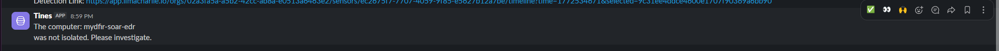

 Alert in Slack after No being selected on the User Prompt.

This design ensures that potentially disruptive containment actions are only performed after human validation. By incorporating this review step, the workflow maintains the efficiency of automation while preserving analyst oversight and operational control.

---

# Automated Endpoint Containment

If the analyst approves containment, the automation workflow proceeds to isolate the endpoint using the LimaCharlie API. This step represents the automated response portion of the workflow and demonstrates how SOAR platforms can interact directly with security tooling to execute defensive actions.

To perform the isolation action, the workflow extracts the **sensor identifier** associated with the endpoint from the detection payload. In LimaCharlie, each monitored endpoint is represented by a unique sensor ID. This identifier allows the platform to determine exactly which host should receive the containment command.

Once the sensor identifier is retrieved, the automation platform sends an API request instructing LimaCharlie to isolate the endpoint from the network. When the isolation command is executed, the endpoint is restricted from communicating with external systems while still allowing the security platform to maintain management access.

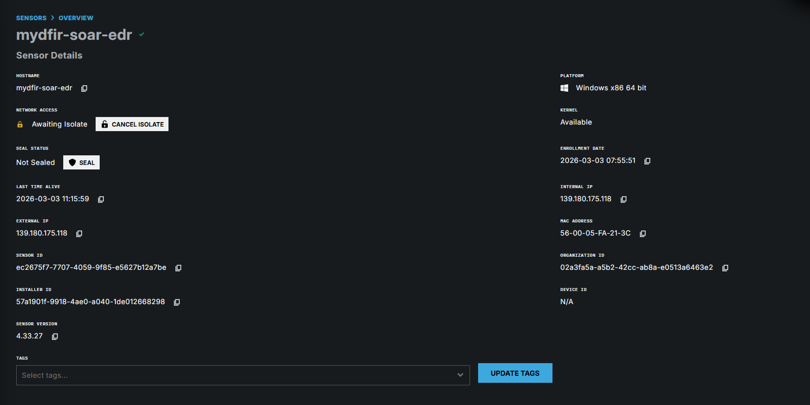

The Windows Endpoint has been isolated from the network.

Testing confirmed that the containment action successfully removed network connectivity from the host. Attempts to initiate outbound network communication from the endpoint failed, demonstrating that the host had been effectively isolated.

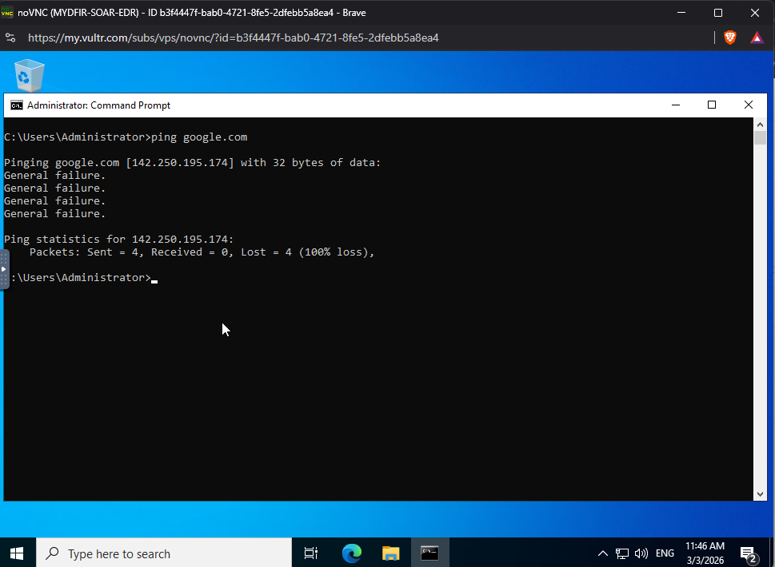

Testing shows the windows endpoint is no longer able to ping websites.

This containment step is a common defensive measure used during incident response. By isolating a compromised system, defenders can prevent attackers from communicating with command-and-control infrastructure or moving laterally to other systems within the environment.

---

# Response Verification

Executing a containment command is only part of the response process. In automated workflows, it is important to verify that the requested action actually occurred. Without verification, the automation system may assume a response succeeded when it did not.

To address this, the workflow queries the EDR platform after the containment command is executed, retrieving the current isolation status of the endpoint. This status is then passed back into the automation workflow and used to generate a confirmation message.

A Slack notification is sent to analysts indicating that the endpoint has been successfully isolated, along with the isolation status returned by the EDR platform. This step matters because it closes the loop — without it, the workflow would have no way to distinguish a successful containment from a silently failed API call.

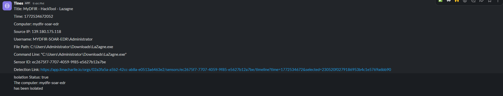

The isolation status is confirmed and then forwarded to the alerts channel in slack.

Verification steps such as this are an important design consideration in automated response pipelines, as they allow automation workflows to validate their actions and provide reliable feedback to analysts.

---

# Final Workflow Result

At the completion of the project, the full workflow operates as an integrated detection and response pipeline. The diagram below shows the complete Tines story connecting all stages — webhook ingestion, Slack/email alerting, analyst decision prompt, conditional containment via the LimaCharlie API, and isolation status verification.

Suspicious activity occurring on the monitored endpoint triggers a detection within the EDR platform. The detection event is automatically forwarded to the SOAR platform through the configured webhook integration. Once the event enters the automation workflow, the detection payload is parsed and key fields are extracted. These fields are used to construct structured alert messages delivered to analysts through Slack and email.

An analyst reviewing the alert is presented with a prompt asking whether the affected endpoint should be isolated. If the analyst approves containment, the workflow interacts with the EDR API to isolate the system from the network. Following containment, the workflow verifies the isolation status of the endpoint and sends a final confirmation message indicating that the host has been successfully isolated.

The end-to-end flow from detection trigger to confirmed containment can complete in under a minute, compared to the multiple manual steps this would otherwise require.

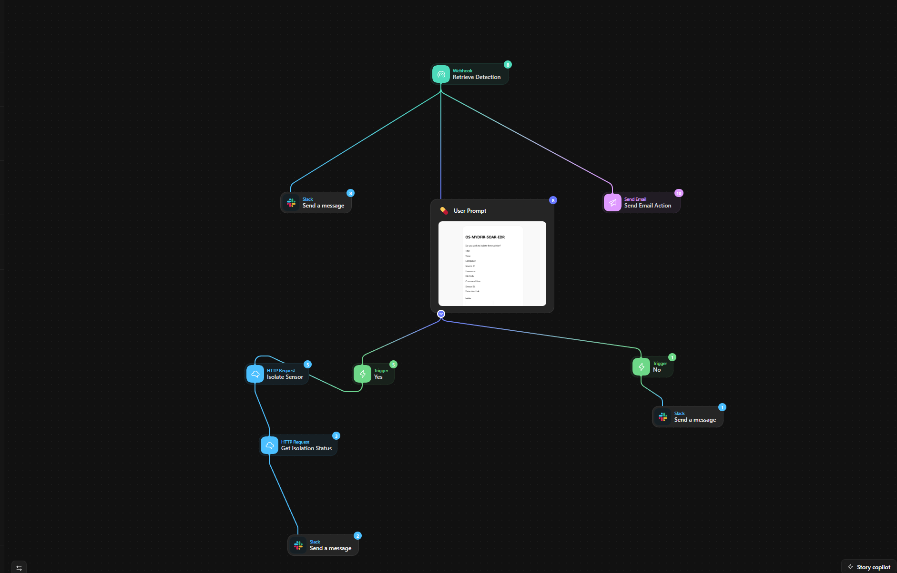

The full automation workflow in Tines.

---

# Key Takeaways

This project demonstrates how security automation can enhance incident response workflows without eliminating the role of the analyst. Automation is used to handle repetitive tasks such as alert delivery, data extraction, and response execution, while analysts retain control over critical containment decisions.

Another key lesson from this project is the value of structured detection data. By extracting specific fields from the detection payload and presenting them in a clear format, the automation workflow provides analysts with actionable context immediately when an alert occurs.

The project also highlights how integrating EDR platforms with SOAR systems can significantly improve response speed. Automated workflows allow security teams to quickly move from detection to containment while maintaining visibility into each step of the response process.

Finally, this project illustrates the importance of designing automation workflows that include validation and feedback mechanisms. By verifying containment actions and notifying analysts of the results, the workflow ensures that automated responses remain transparent, reliable, and operationally safe.

---

# Limitations and Potential Improvements

This project intentionally scopes the workflow to a single detection use case in order to focus on demonstrating the integration between EDR and SOAR. There are several limitations worth noting for anyone building on this foundation:

**Detection coverage is narrow.** The D&R rule targets a single tool (LaZagne) by process name and file path. A real-world deployment would benefit from broader detection coverage — including hash-based, parent-process, and command-line argument matching — to reduce the chance of evasion through simple renaming.

**No alert deduplication or rate limiting.** If the tool is executed multiple times rapidly, the workflow will fire for each event independently. In a production environment, deduplication logic or cooldown windows should be added to avoid alert fatigue.

**No dedicated SIEM integration.** While LimaCharlie provides built-in telemetry retention and timeline visibility that covers some SIEM-like functionality, a dedicated SIEM integration would add longer-term log retention, correlation across non-endpoint sources, and structured audit trails for compliance purposes.

**Analyst prompt has no timeout handling.** If the analyst does not respond to the containment prompt, the workflow simply waits indefinitely. Adding a timeout with an automatic escalation path or default-deny behaviour would make the workflow more operationally robust.

**Single-endpoint scope.** The workflow is designed to handle one endpoint at a time. Multi-host environments would require logic to handle concurrent detections across different systems without workflow collisions.